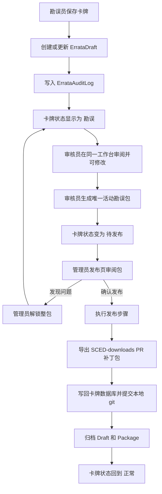

# 勘误审核工作台重做 — 设计规格

## 概述

本次重做将“卡牌勘误、我的勘误、勘误审核、勘误包发布”统一到一套共享卡牌工作台中。核心目标是让审核人员能像勘误人员一样看到完整三视图、直接修改勘误副本，并把确认后的卡牌生成一个唯一活动勘误包，交给管理员发布。

当前系统仍处于开发阶段，因此可以直接重构旧的二级角色和旧 `Errata` 一人一条记录模型，不需要保留兼容旧页面或旧普通用户角色。

## 背景与问题

当前 `ReviewPage` 只是一个勘误表格，只显示卡号、提交者、状态和提交时间，无法看到英文参考、中文现状、本地渲染结果，也无法判断勘误内容是否正确。审核员只能批量通过或驳回，实际上无法完成有效审核。

当前 `CardBrowserPage` 已经承载了更完整的勘误编辑能力，但它与审核页割裂，导致同一套卡牌三视图、JSON 编辑、渲染校验、状态标签逻辑容易重复维护。

同时，旧模型中同一张卡可以被不同用户提交多条 `Errata` 记录。这会造成多个勘误副本并存，难以判断哪一份是当前有效内容，也不利于后续按卡牌生成稳定发布包。

## 设计目标

1. 用统一工作台替代分裂页面，减少重复 UI 和重复业务逻辑。
2. 每张卡只保留一份当前活动勘误副本，多人协作写入同一副本。
3. 每次保存、修改、审核、打包、退回、发布都写入审计日志。
4. 卡牌列表清晰显示勘误状态和参与账号。
5. 审核员可以直接修改勘误副本，不再使用“驳回再改”的低效流程。
6. 系统同一时间只允许一个活动勘误包，保持发布边界简单可靠。
7. 发布完成后将勘误内容合并回 `卡牌数据库`，归档当前副本，卡牌回到正常状态。

## 非目标

1. 第一版不支持多个并行待发布勘误包。
2. 第一版不做复杂任务流引擎。
3. 第一版不保留旧 `用户` 角色。
4. 第一版不允许拆分勘误包中的单卡独立退回；退回只按整包处理。
5. 第一版不直接修改官方 `SCED` 或 `SCED-downloads` 仓库，发布仍以导出补丁包为主。

## 权限模型

### 角色

| 角色 | 权限 |
|------|------|
| 勘误员 | 查看所有本地 `.card` 卡牌，提交和修改当前勘误副本，查看“我的勘误” |
| 审核员 | 只查看当前处于“勘误”状态的卡牌，直接修改副本，生成勘误包 |
| 管理员 | 拥有勘误员和审核员全部权限，并拥有用户管理、映射管理、发布管理 |

旧 `UserRole.USER` 不再保留，迁移为 `勘误员`。

### 导航

| 页面 | 可访问角色 | 工作台范围 |
|------|------------|------------|
| 卡牌勘误 | 勘误员、管理员 | 全部有本地 `.card` 的卡牌 |
| 我的勘误 | 勘误员、管理员 | 当前用户参与过的勘误卡牌 |
| 勘误审核 | 审核员、管理员 | 当前处于“勘误”状态的卡牌 |
| 勘误包生成 | 审核员、管理员 | 可生成唯一活动勘误包的勘误卡牌 |
| 发布管理 | 管理员 | 当前和历史勘误包 |
| 用户管理 | 管理员 | 创建、禁用、重置密码、修改角色 |

## 状态模型

### 卡牌勘误状态

| 状态 | 含义 | 可编辑人 |
|------|------|----------|
| 正常 | 没有当前活动勘误副本 | 勘误员、管理员可创建新副本 |
| 勘误 | 有当前活动勘误副本，正在被勘误或审核 | 勘误员、审核员、管理员可按权限修改 |
| 待发布 | 已生成勘误包，等待管理员发布 | 默认锁定；管理员可解锁整个包 |

发布完成后，勘误内容合并回 `卡牌数据库`，当前副本归档，卡牌状态回到 `正常`。后续再次修改时创建新的活动副本，并进入新的勘误包周期。

### 勘误包状态

| 状态 | 含义 |
|------|------|
| 待发布 | 审核员已生成包，管理员可以审阅和发布 |
| 发布中 | 管理员正在执行发布流程 |
| 已发布 | 发布完成，包内卡牌已写回 `卡牌数据库` 并归档 |
| 已退回 | 管理员解锁退回，包内卡牌重新回到“勘误”状态 |

系统全局只允许存在一个 `待发布` 或 `发布中` 的活动包。存在活动包时，审核员不能生成第二个包。新的勘误卡牌可以继续进入“勘误”状态，但不能自动加入已锁定包。

## 发布粒度

勘误发布按“整张卡牌”而不是单个 `.card` 文件处理。

- `arkhamdb_id` 是勘误副本的主粒度。
- 双面卡的 `a/b` 两个本地文件视为同一个勘误对象。
- 即使只修改了 `a` 面，生成勘误包和发布时也必须带上 `a/b` 两面。
- 单面卡只有一个本地正面内容，发布时仍携带对应卡背设置。
- 发布时使用映射索引确定每个本地面对应的 TTS 英文参考、中文现状和替换目标。

## 数据模型

### `User`

更新 `role` 枚举：

- `勘误员`
- `审核员`
- `管理员`

管理员用户管理功能需要支持：

- 创建用户
- 禁用或启用用户
- 重置密码
- 修改角色

### `ErrataDraft`

当前活动勘误副本。每个 `arkhamdb_id` 同一时间最多一份未归档副本。

建议字段：

| 字段 | 说明 |
|------|------|
| `id` | 主键 |
| `arkhamdb_id` | 卡牌编号 |
| `status` | `正常` 不落表；活动副本为 `勘误` 或 `待发布` |
| `original_faces` | 创建副本时从本地 `.card` 读取的 a/b 原始 JSON 快照 |
| `modified_faces` | 当前勘误后的 a/b JSON 内容 |
| `changed_faces` | 实际修改过的面，例如 `["a"]` 或 `["a", "b"]` |
| `package_id` | 所属勘误包，未打包时为空 |
| `rendered_previews` | 当前本地预发布渲染图路径，按面保存 |
| `created_by` | 首次创建副本的用户 |
| `updated_by` | 最后修改用户 |
| `archived_at` | 发布完成后归档时间 |
| `created_at` | 创建时间 |
| `updated_at` | 更新时间 |

唯一约束：`arkhamdb_id + archived_at is null` 只能存在一条活动记录。

### `ErrataAuditLog`

记录勘误副本生命周期内的所有动作。卡牌列表中的参与账号由日志去重得到。

建议字段：

| 字段 | 说明 |
|------|------|
| `id` | 主键 |
| `draft_id` | 关联勘误副本 |
| `arkhamdb_id` | 冗余卡牌编号，便于查询 |
| `user_id` | 操作人 |
| `action` | `创建副本`、`保存勘误`、`审核修改`、`生成包`、`解锁退回`、`发布完成` |
| `from_status` | 操作前状态 |
| `to_status` | 操作后状态 |
| `changed_faces` | 本次修改涉及的面 |
| `content_hash` | 修改后内容摘要 |
| `diff_summary` | 简要差异摘要，用于列表和日志展示 |
| `created_at` | 操作时间 |

### `ErrataPackage`

勘误包是发布流程的边界。

建议字段：

| 字段 | 说明 |
|------|------|
| `id` | 主键 |
| `package_no` | 人类可读包编号，例如 `ERRATA-20260426-001` |
| `status` | `待发布`、`发布中`、`已发布`、`已退回` |
| `created_by` | 生成包的审核员或管理员 |
| `published_by` | 发布管理员 |
| `unlocked_by` | 解锁退回管理员 |
| `note` | 包说明或退回说明 |
| `created_at` | 生成时间 |
| `updated_at` | 更新时间 |
| `published_at` | 发布完成时间 |

包与卡牌的关系可以通过 `ErrataDraft.package_id` 表示。第一版不需要额外拆分包明细表，除非后续需要记录包内排序或单卡发布元数据。

## API 设计

### 用户管理

| 方法 | 路径 | 权限 | 功能 |
|------|------|------|------|
| `GET` | `/api/auth/me` | 登录用户 | 获取当前用户 |
| `GET` | `/api/auth/users` | 管理员 | 用户列表 |
| `POST` | `/api/auth/users` | 管理员 | 创建用户 |
| `PATCH` | `/api/auth/users/{id}` | 管理员 | 修改角色、启用状态 |
| `POST` | `/api/auth/users/{id}/reset-password` | 管理员 | 重置密码 |

### 卡牌工作台

| 方法 | 路径 | 权限 | 功能 |
|------|------|------|------|
| `GET` | `/api/cards/tree?scope=all` | 勘误员、管理员 | 全部本地卡牌树 |
| `GET` | `/api/cards/tree?scope=mine` | 勘误员、管理员 | 我参与过的勘误卡牌树 |
| `GET` | `/api/cards/tree?scope=review` | 审核员、管理员 | 当前“勘误”状态卡牌树 |
| `GET` | `/api/cards/tree?scope=package&package_id=...` | 管理员 | 指定包内卡牌树 |

返回的卡牌节点需要包含：

- `arkhamdb_id`
- `name_zh`
- `local_files`
- `errata_state`: `正常`、`勘误`、`待发布`
- `participant_usernames`
- `package_id`
- `latest_audit_at`

### 勘误副本

| 方法 | 路径 | 权限 | 功能 |
|------|------|------|------|
| `GET` | `/api/errata-drafts/{arkhamdb_id}` | 有工作台访问权 | 读取整张卡的当前副本和 a/b 面内容 |
| `PUT` | `/api/errata-drafts/{arkhamdb_id}` | 勘误员、审核员、管理员 | 创建或保存当前副本 |
| `POST` | `/api/errata-drafts/{arkhamdb_id}/render` | 勘误员、审核员、管理员 | 渲染校验并刷新预发布图 |
| `GET` | `/api/errata-drafts/{arkhamdb_id}/logs` | 有工作台访问权 | 查看审计日志 |

保存规则：

- `正常` 卡牌首次保存时创建活动副本并写入 `创建副本` 和 `保存勘误` 日志。
- `勘误` 卡牌再次保存时更新同一副本并写入日志。
- `待发布` 卡牌禁止普通保存；必须管理员解锁包后才能修改。

### 审核与打包

| 方法 | 路径 | 权限 | 功能 |
|------|------|------|------|
| `POST` | `/api/admin/review/package` | 审核员、管理员 | 将选中的“勘误”卡牌生成唯一活动包 |

生成包规则：

- 请求传入 `arkhamdb_ids`。
- 所有卡牌必须处于 `勘误` 状态。
- 系统中不能存在 `待发布` 或 `发布中` 活动包。
- 成功后创建 `ErrataPackage`，将选中 draft 状态改为 `待发布`，写入 `生成包` 审计日志。

### 发布包

| 方法 | 路径 | 权限 | 功能 |
|------|------|------|------|
| `GET` | `/api/admin/packages` | 管理员 | 包列表 |
| `GET` | `/api/admin/packages/{id}` | 管理员 | 包详情和包内卡牌 |
| `POST` | `/api/admin/packages/{id}/unlock` | 管理员 | 整包解锁退回 |
| `POST` | `/api/admin/publish/step1-generate-sheets` | 管理员 | 按 `package_id` 生成精灵图 |
| `POST` | `/api/admin/publish/step2-upload` | 管理员 | 上传图床 |
| `POST` | `/api/admin/publish/step3-export-tts` | 管理员 | 导出 TTS 存档 |
| `POST` | `/api/admin/publish/step5-upload-tts-json` | 管理员 | 上传 Steam 返回 JSON 并提取 URL |
| `POST` | `/api/admin/publish/step6-export-replacements` | 管理员 | 导出 `SCED-downloads` PR 补丁包 |
| `POST` | `/api/admin/packages/{id}/complete` | 管理员 | 标记发布完成、写回卡牌数据库并归档 |

发布步骤不能再完全信任前端传入的 `approved_cards`。后端必须以 `package_id` 查出包内 `ErrataDraft`，再结合映射索引生成发布输入。

## 前端设计

### 共享组件

抽出 `CardWorkbench`，封装卡牌树、卡牌详情加载、三视图、JSON 编辑、渲染校验、保存按钮和日志展示。

建议组件拆分：

| 组件 | 责任 |
|------|------|
| `CardWorkbench` | 工作台容器，接收 `mode` 和权限配置 |
| `CardTreePanel` | 左侧分类树、搜索、状态标签、参与者展示 |
| `CardDetailPanel` | 右侧卡牌详情布局 |
| `CardComparison` | 英文参考、中文现状、本地预发布三视图 |
| `ErrataJsonEditor` | a/b 面 JSON 编辑与切换 |
| `ErrataAuditTimeline` | 操作日志时间线 |
| `PackageActionBar` | 审核页生成包、发布页解锁包等动作区 |

### 工作台模式

| 模式 | 页面 | 左侧范围 | 右侧能力 |
|------|------|----------|----------|
| `errata-all` | 卡牌勘误 | 全部本地卡牌 | 编辑、保存、渲染 |
| `my-errata` | 我的勘误 | 我参与过的勘误卡牌 | 编辑、保存、渲染 |
| `review` | 勘误审核 | `勘误` 状态卡牌 | 审核修改、保存、渲染、生成包 |
| `package-review` | 发布包审阅 | 指定包内卡牌 | 默认只读，管理员可解锁整包 |

### 三视图语义

- 左：英文 TTS 当前状态，只读标准参考。
- 中：中文 TTS 当前状态，只读游戏现状。
- 右：本地 `.card` 渲染/预发布结果，表示本次勘误将发布的效果。

英文和中文参考不提供编辑入口。卡背设置、映射调整等管理员行为仍放在映射管理页面，不放给普通勘误用户。

### 左侧卡牌项

卡牌项只显示对用户有用的信息：

- 卡号
- 中文名
- 状态标签：`正常`、`勘误`、`待发布`
- 参与账号：最多展示前两个账号，多余显示 `+N`
- 面信息：`a/b` 或单面

不显示“映射已确认”等内部维护状态。

## 发布与写回流程

发布完成时需要执行两类输出：

1. 生成 `SCED-downloads` 替换补丁包，供管理员复制到自己的 fork 后提交 PR。
2. 将勘误后的 `.card` 内容写回 `卡牌数据库`，并在 `卡牌数据库` 仓库创建本地 git commit，方便回滚和审计。

写回前必须以后端包数据为准，不允许前端直接传任意 `.card` 内容触发批量写回。

## 错误处理

1. 如果存在活动包，生成新包返回中文错误：`当前已有待发布或发布中的勘误包，请先发布或解锁后再生成新包`。
2. 如果用户尝试修改 `待发布` 卡牌，返回中文错误：`该卡牌已进入待发布包，请管理员解锁后再修改`。
3. 如果审核员访问无勘误卡牌，左侧显示空态：`当前没有需要审核的勘误卡牌`。
4. 如果发布包解锁失败，不能改变包内 draft 状态，必须保持事务一致性。
5. 如果写回 `卡牌数据库` 失败，包不能标记为 `已发布`，需要保留错误信息供管理员重试。

## 迁移策略

由于系统仍处于开发阶段，可以进行破坏性模型重构，但需要保留现有实验数据的可追溯性。

1. 将旧 `用户` 角色迁移为 `勘误员`。
2. 管理员保留为 `管理员`。
3. 如旧 `Errata` 表存在数据：
   - 按 `arkhamdb_id` 合并为一份 `ErrataDraft`；
   - 使用最新 `modified_content` 作为当前副本；
   - 为每条旧记录生成对应 `ErrataAuditLog`；
   - 原提交人进入参与账号列表。
4. 旧审核批次数据如果无法无歧义迁移，可以保留只读备份表或迁移为历史包，并在 UI 中不作为活动包展示。

## 测试计划

### 后端测试

1. 权限矩阵：勘误员、审核员、管理员分别验证各 API 可访问范围。
2. 多人协作：两个勘误员修改同一张卡，只产生一份活动 draft，日志中出现两个参与者。
3. 双面卡发布：只修改正面时，包内仍包含正反两面内容。
4. 活动包唯一：存在 `待发布` 或 `发布中` 包时，生成新包失败。
5. 整包解锁：包状态变 `已退回`，包内 draft 回到 `勘误`。
6. 发布完成：写回 `卡牌数据库`、归档 draft、包状态变 `已发布`、卡牌回到 `正常`。
7. 待发布锁定：普通保存接口拒绝修改已入包卡牌。
8. 审计日志：创建、保存、审核修改、打包、解锁、发布都写日志。

### 前端验收

1. `/cards`、`/my-errata`、`/admin/review` 使用同一套工作台布局。
2. 左侧树点击分类整行可展开，卡牌项显示状态和参与账号。
3. 勘误员在 `/cards` 保存后，卡牌状态变为 `勘误`。
4. “我的勘误”只显示当前用户参与过的勘误卡牌。
5. 审核员在审核页能看到三视图、直接修改并渲染校验。
6. 审核员生成包后，卡牌状态变 `待发布`，并锁定编辑。
7. 管理员发布页能看到活动包、进入包审阅、解锁退回或进入发布流程。
8. 管理员用户管理页能创建、禁用、重置密码和修改角色。

## 实施顺序建议

1. 新增角色枚举、用户管理 API 和前端用户管理页。
2. 新增 `ErrataDraft`、`ErrataAuditLog`、`ErrataPackage` 模型和迁移。
3. 实现勘误副本 API、审计日志、卡牌树 scope 过滤。
4. 抽出 `CardWorkbench`、`CardTreePanel`、`CardDetailPanel` 等共享组件。
5. 用 `CardWorkbench` 重建 `/cards`、`/my-errata`、`/admin/review`。
6. 实现唯一活动勘误包生成和整包解锁。
7. 改造发布 API 以 `package_id` 为输入，禁止信任前端传入卡牌列表。
8. 实现发布完成后的 `卡牌数据库` 写回和本地 git commit。
9. 补齐后端测试、前端构建和关键页面手工验收。

## 验收标准

1. 审核员不再看到无信息量表格，而是看到与卡牌浏览一致的三视图工作台。
2. 同一卡多人勘误只存在一份当前活动副本，参与者账号全部显示。
3. 卡牌状态只有 `正常`、`勘误`、`待发布` 三种用户可见状态。
4. 任何时刻最多存在一个活动勘误包。
5. 待发布包被管理员解锁后，包内卡牌整体回到 `勘误` 状态。
6. 发布流程只能从后端包数据读取卡牌，不依赖前端传入任意 approved_cards。
7. 发布完成后，勘误内容写回 `卡牌数据库` 并归档，卡牌回到 `正常`。
